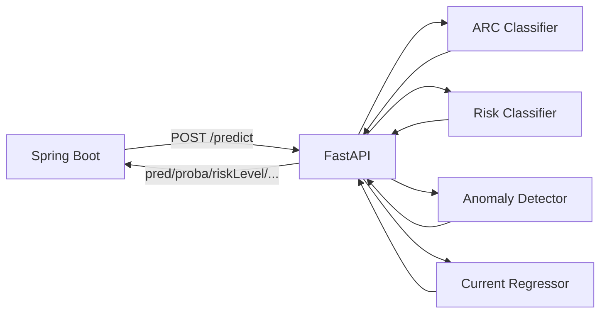
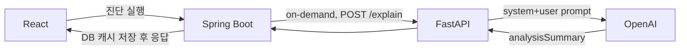
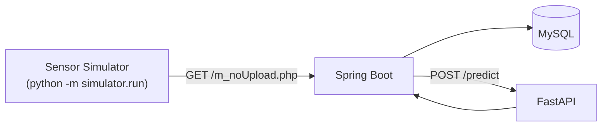

# ⚡ ArcGuard AI

ArcGuard 시스템에서 분전반 센서 시계열 데이터를 분석해 전기 이상 상태를 판정하는 **Python/FastAPI 기반 AI 추론 서비스**입니다.

실제 하드웨어는 존재하지 않습니다. 이 저장소가 직접 만든 **Sensor Simulator**와 **Synthetic Dataset Generator**로 시나리오를 재현하고, 그 위에서 학습한 모델을 서빙하는 개인 포트폴리오 프로젝트입니다. 연구 논문이 아니라 "AI를 백엔드 시스템의 한 구성요소로 안전하게 통합하는 구조"를 보여주는 것을 목표로 합니다.

전체 시스템은 3개 저장소로 나뉩니다.

| 저장소 | 역할 |
|---|---|
| [firesafety-be](https://github.com/soyoung-v/firesafety-be) | Spring Boot API 서버 — 센서 수신, DB, 인증, 이 AI 서비스 호출 |
| [firesafety-fe-react](https://github.com/soyoung-v/firesafety-fe-react) | React 관제 대시보드 |
| **firesafety-ai** (이 저장소) | ML 추론 + LLM 설명 생성 서비스 |

---

## AI Architecture

FastAPI 자체가 "AI"인 것이 아니라, **학습된 scikit-learn 모델을 외부(Spring Boot)에서 호출할 수 있게 노출하는 추론 서비스**입니다. 판정 로직은 모델이 갖고, 이 서비스는 모델 로딩·요청 검증·Feature 계산·응답 조립만 담당합니다.



LLM 설명은 완전히 별도 경로입니다.



`/predict`와 `/explain`은 서로를 호출하지 않고, 상태도 공유하지 않습니다(ADR-006). LLM 장애가 ML 판정에 영향을 주지 않도록 설계했습니다.

---

## Dataset

`training/dataset/generator.py`(`DatasetGenerator`)가 6개 시나리오 × 시나리오당 40 run × run당 400 sample = **총 96,000행**의 Synthetic Dataset을 생성합니다(현재 코드 기본값 기준, `seed=42`).

| 항목 | 값 |
|---|---|
| 시나리오 수 | 6 |
| 시나리오당 run 수 | 40 (`DEFAULT_RUNS_PER_SCENARIO`) |
| run당 sample 수 | 400 (`DEFAULT_SAMPLES_PER_RUN`) |
| 총 row 수 | 96,000 |
| risk_level 비율(설계 목표) | NORMAL 40% / WARNING 30% / DANGER 30% |
| 실제 생성 결과(row 기준) | NORMAL 48,000 / WARNING 24,000 / DANGER 24,000 |
| seed | 42 |

Train/Validation/Test는 **row가 아니라 run_id 단위**로 나눕니다(`training/features/split.py`) — 같은 run에서 나온 window가 서로 다른 split에 걸치면 데이터 누수가 되기 때문입니다. 시나리오별로 stratify하며 비율은 **train 70% / val 15% / test 15%**입니다.

컬럼 구성은 메타(`run_id`/`timestamp`/`sample_index`/`m_no`/`mode`/`circuit`), 물리 센서값(`current`/`arc_count`/`voltage`/`leakage_current`/`temperature`/`humidity`/`fire_raw`/`gas_raw`/`door_open`/`total_current`/`total_power`), 정답 라벨(`scenario`/`risk_level`)입니다. **이 데이터는 100% synthetic이며 실제 센서 로그가 아닙니다.**

---

## Scenario Engine

`training/scenario/registry.py`에 등록된 6개 시나리오입니다.

| 시나리오 | 핵심 변화 센서 | WARNING | DANGER |
|---|---|---|---|
| `NORMAL` | 없음(baseline 유지) | - | - |
| `OVER_CURRENT` | `current`, `total_current` | 상승 시작 | `total_current` ≥ 30A 유지 |
| `ARC` | `current`(변동성), `arc_count` | 변동성 증가 | 불규칙 급변 + count 급증 |
| `LEAKAGE` | `leakage_current` | 상승 시작 | `leakage_current` ≥ 20mA 유지 |
| `OVERHEATING` | `temperature` | 상승 시작 | `temperature` ≥ 80℃ 유지 |
| `COMPLEX_RISK` | run마다 아래 3개 조합 중 무작위 1개 선택 후 두 시나리오의 override를 합성 | 조합된 두 시나리오의 WARNING override 합 | 조합된 두 시나리오의 DANGER override 합 |

각 run은 NORMAL(40%, baseline) → WARNING(30%, **ramp**: NORMAL 값에서 목표치로 점진 상승) → DANGER(30%, **hold**: 진입 즉시 목표 수준 유지)의 3단계로 구성됩니다(`training/scenario/config.py::build_three_phase_spec`). DANGER를 hold로 둔 이유는 "임계치 초과 지속" 상태가 중간값으로 애매하게 라벨링되지 않도록 하기 위해서입니다. `COMPLEX_RISK`는 `(OVERHEATING, OVER_CURRENT)` / `(ARC, LEAKAGE)` / `(OVERHEATING, LEAKAGE)` 3개 조합 중 run마다 무작위로 하나를 골라 두 시나리오의 WARNING/DANGER override를 합성합니다(firesafety-be에 대응 로직이 없는 순수 신규 시나리오).

`LEAK_MA_THRESHOLD=20.0`(mA), `TEMP_THRESHOLD_C=80.0`(℃), `OVERCURRENT_THRESHOLD_A=30.0`(A)는 firesafety-be 코드(`DeviceAlertService`/`PanelStatusAggregationService`)의 실제 기본값과 일치를 확인한 값이고, WARNING 단계의 상승폭·표준편차 등은 이 프로젝트가 시뮬레이션용으로 임의 설정한 값입니다. **법적/산업 표준이 아니라 이 프로젝트 내부 시뮬레이션 규칙**입니다.

---

## Feature Engineering

### Window

모델 입력은 **60개 sample 단위 window**입니다(`WINDOW_SIZE = 60`, `training/features/window.py`). non-overlapping(`stride = 60`)이 기본값이며, run 경계를 넘지 않고 꼬리에 남는 미달분은 버립니다. **"60초"나 "60분"이 아니라 "60개 sample"**입니다 — 실제 센서 전송 주기는 이 프로젝트 범위 밖(TBD)입니다.

### Label leakage 방지 — `aerror` 제외 (ADR-001)

하드웨어 알람/에러 비트필드 `aerror`(및 파생 `device_arc_flag`)는 **모델 입력 feature로 계산하지 않습니다.** `aerror`의 ARC 비트는 이 프로젝트가 풀려는 문제(ARC 여부 판정)의 정답과 사실상 동일해서, 그대로 입력에 넣으면 모델이 센서 원시값 패턴이 아니라 "이미 정답에 가까운 신호" 하나만 보고 학습하게 됩니다. `training/features/columns.py`의 `FORBIDDEN_FEATURE_COLUMNS`에 명시적으로 올라 있고, 애초에 Feature Dataset 컬럼으로도 생성하지 않습니다.

### 모델별 입력 feature

| 모델 | feature 수 | 원천 컬럼 |
|---|---|---|
| ARC Classifier | 7 | `current`, `arc_count` (레거시 계약 재현) |
| Risk Classifier / Anomaly Detector | 21 | `current`, `arc_count`, `leakage_current`, `temperature`, `total_current` |
| Current Regressor | 8 | `current` |

`voltage`/`humidity`/`gas_raw`/`fire_raw`/`door_open`/`total_power`는 Risk/Anomaly feature에서 제외했습니다 — Dataset Generator가 이 필드들을 어떤 시나리오에서도 baseline 대비 변화시키지 않아 구성상 판별력이 없기 때문입니다(`training/features/risk.py` 주석).

각 feature는 `mean`/`std`/`range`(max-min)/`diff_abs`(연속 차분의 절대값 평균) 같은 window 통계량이며, 추세는 **선형회귀가 아니라 endpoint 기반 기울기**((끝값-시작값)/(n-1))로 계산합니다(`endpoint_slope`, 재현성·설명력 우선).

---

## Models

`artifacts/model_manifest.json` 기준 4개 모델이며, 전부 `training/models/*_inference.py`의 wrapper 클래스로 로드됩니다.

### 1. ARC Classifier — `LogisticRegression`

기존(레거시) Spring Boot 계약을 그대로 재현하는 이진 분류기입니다. feature 7개, `pred`(0/1)와 `proba`(ARC 확률)만 반환하며 threshold는 0.5(`training/models/arc_metrics.py::THRESHOLD`)입니다. **`pred`/`proba`는 다른 모델의 `riskLevel`/`riskScore`와 의미가 다릅니다 — 섞어서 해석하지 않습니다.**

### 2. Risk Classifier — `LogisticRegression`

`NORMAL`/`WARNING`/`DANGER` 3클래스 분류기입니다. `riskScore`는 **화재 확률이 아니라**, 클래스별 확률에 심각도 가중치(NORMAL=0.0, WARNING=0.5, DANGER=1.0)를 곱한 기댓값입니다(`training/models/risk_inference.py`):

```
riskScore = P(NORMAL)×0.0 + P(WARNING)×0.5 + P(DANGER)×1.0
```

### 3. Anomaly Detector — `IsolationForest`

`risk_level == 'NORMAL'` 구간(6개 시나리오 전체의 정상 구간)만으로 학습한 비지도 이상 탐지 모델입니다(ADR-004). raw score를 부호 반전 후 학습 데이터의 min/max로 0~1 정규화한 값이 `anomalyScore`이며, threshold(약 0.615)를 넘으면 `anomaly=true`입니다.

### 4. Next-current Regressor — `HistGradientBoostingRegressor`

`predictedCurrent`는 **"다음 측정 시점(next sample)의 전류 예측값"**입니다. 몇 초/몇 분 뒤 값이 아닙니다 — 같은 run 안에서 window 바로 다음 sample의 `current`를 target으로 학습했고(`training/features/current_target.py`), 다음 sample이 없는 run의 마지막 window는 애초에 target을 만들지 않습니다.

### 평가 결과 (Synthetic Dataset test split 기준, `artifacts/reports/`)

| 모델 | 지표 | 값 |
|---|---|---|
| ARC Classifier | accuracy / f1 / roc_auc | 1.0 / 1.0 / 1.0 |
| Risk Classifier | accuracy / macro_f1 | 0.986 / 0.984 |
| Anomaly Detector | precision / recall / f1 | 0.984 / 1.0 / 0.992 |
| Current Regressor | MAE / R² (baseline 대비 MAE 개선율) | 1.24 / 0.802 (22.3%) |

**모두 synthetic test split 기준 수치이며, 실제 전기화재 탐지·예방 성능이나 안전 인증을 의미하지 않습니다**(각 metadata.json에 동일 문구가 명시되어 있습니다).

---

## Window / Frame Alignment

`/predict`의 `context.samples`는 flat한 스냅샷 객체가 아니라 `circuits[].samples`와 **같은 개수·순서를 갖는 시계열 배열**로 설계했습니다(`app/schema/predict.py::ContextRequest`). 이유는 두 가지입니다.

1. Risk/Anomaly의 21개 feature 중 `leak_std`/`temp_slope`/`tcur_max` 등은 시계열이 있어야 계산 가능합니다. 스냅샷 값 하나만 받으면 std=0/slope=0인 가짜 시계열을 만드는 셈이 됩니다.
2. 회로 센서(`circuit.samples`)와 분전반 공통 센서(`context.samples`)를 "최신값"으로 임의 결합하면, 실제로는 다른 시점의 데이터가 하나의 window로 섞일 수 있습니다.

`app/service/feature_service.py::context_is_sufficient`가 이 정렬 조건(길이 일치 + 필수 필드 존재)을 명시적으로 검증하고, 만족하지 못하면 Risk/Anomaly는 계산하지 않고 `null`을 반환합니다(가짜 값을 채우지 않음). 실제 DB 레벨에서 같은 `frame_id` 집합으로 센서 로그를 정렬해 이 요청을 만드는 책임은 호출자인 firesafety-be에 있습니다 — 이 저장소는 "정렬된 입력이 아니면 계산하지 않는다"는 계약으로 그 정합성을 강제합니다.

---

## Inference API

| Method | Path | 역할 |
|---|---|---|
| GET | `/health` | 서비스/모델 로딩 상태 |
| GET | `/model-info` | 모델별 공개 메타데이터 (운영 편의용 내부 엔드포인트 — Spring Boot/React가 사용하는 사용자 기능이 아님) |
| POST | `/predict` | 4개 모델 추론 (핵심 경로) |
| POST | `/explain` | LLM 기반 한국어 설명 생성 (별도 경로) |

### GET /health

```json
{ "status": "UP", "models": { "arcClassifier": true, "riskClassifier": true, "anomalyDetector": true, "currentRegressor": true }, "llmExplanationConfigured": false }
```

`arcClassifier`가 로드 실패하면 서비스 자체가 기동하지 않습니다(레거시 계약 필수 모델). 나머지 3개는 로드 실패해도 서비스는 뜨고 `status`가 `DEGRADED`로 표시됩니다(`app/service/model_registry.py`).

### POST /predict

요청은 `m_no`/`circuits[].circuit`/`circuits[].samples[].am`/`circuits[].samples[].count`(기존 계약, 회로당 최소 30개 sample) + optional `context.samples`(신규 확장)로 구성됩니다. 응답의 `results[]`는 기존 5개 필드(`circuit`/`proba`/`pred`/`n_samples`/`warning`)와 신규 5개 필드(`riskLevel`/`riskScore`/`anomaly`/`anomalyScore`/`predictedCurrent`)를 함께 반환하며, 계산 불가능한 확장 필드는 키를 생략하지 않고 `null`로 채웁니다.

**`pred`/`proba`(ARC Classifier)와 `riskLevel`/`riskScore`(Risk Classifier)는 서로 다른 모델의 서로 다른 출력**입니다. 예를 들어 `riskLevel="DANGER"`라고 해서 `pred=1`(ARC)로 매핑되지 않습니다 — 두 모델은 독립적으로 계산됩니다.

### POST /explain

자세한 내용은 아래 [LLM Explanation](#llm-explanation) 참고.

---

## LLM Explanation

LLM은 **판정 모델이 아닙니다.** 이미 계산이 끝난 ML 결과와, 그 근거로 쓸 수 있는 축약된 센서 스냅샷을 받아 한국어 문장으로 요약할 뿐입니다.

```
ML 결과(pred/proba/riskLevel/riskScore/anomaly/anomalyScore/predictedCurrent)
+ 축약 센서 스냅샷(current/arcCount/temperature/leakageCurrent/totalCurrent)
+ (optional) 호출자가 이미 계산한 추세값(currentSlope/temperatureSlope)
→ LLM
→ analysisSummary (문자열 1개)
```

### LLM에 전달하지 않는 정보 (`app/schema/explain.py`, `extra="forbid"`)

- Synthetic Dataset 정답값(`scenario`, `risk_level` ground truth, `run_id`, `split`)
- `aerror` 등 정답에 가까운 hidden label
- 원시 센서 sample 배열 전체(60개 등) — `/explain`은 애초에 원시 시계열을 받지 않는 스키마

이 필드들은 `ExplainRequest`에 아예 존재하지 않아서, 실수로 섞여 보내도 422로 거절됩니다(스키마 레벨 강제).

시스템 프롬프트는 `pred`/`riskLevel`/`anomalyScore` 같은 내부 필드명을 문장에 그대로 나열하지 않고
"아크 판정", "종합 위험도", "이상 패턴" 같은 자연어로 옮겨 쓰도록 지시하며, 센서 근거는 제공된 값을 전부
나열하는 대신 판정과 관련 있는 2~3개만 골라 언급하게 한다. 신뢰도를 언급할 때는 기존 UI(API-101)와
동일한 방향으로 계산한 값(ARC 판정이면 `proba`, 정상 판정이면 `1-proba`)을 %로 쓰도록 안내하며, 이
파생값은 evidence 생성 단계에서만 계산되고 ML 원본 `pred`/`proba` 값 자체는 바뀌지 않는다.

### Safety boundary (`app/service/explanation_prompt.py::SYSTEM_PROMPT`)

- ML 결과값을 변경·재계산하지 않는다 (그대로 인용만 한다)
- `riskScore`/`anomalyScore`를 화재 발생 확률처럼 표현하지 않는다
- 제공되지 않은 센서값을 추측/생성하지 않는다
- 원인을 확정적으로 단정하지 않는다("~가 근거로 관찰됩니다" 형태)
- `predictedCurrent`를 특정 시간 단위(초/분) 뒤의 값으로 표현하지 않는다
- 존재하지 않는 임계값(특히 GAS/FIRE 기준 — 현재 TBD)을 임의로 언급하지 않는다
- 실제 안전 인증을 받은 시스템인 것처럼 표현하지 않는다

`/predict`와 `/explain`은 상태를 공유하지 않고, `/explain` 실패(LLM timeout/API 오류 등)는 ML 판정·저장에 어떤 영향도 주지 않습니다(`app/api/explain.py`).

### LLM Provider 구조

`ExplanationProvider`(abstract, `app/service/explanation_provider.py`)를 최소 인터페이스로 두고 `OpenAiExplanationProvider`가 이를 구현합니다(`app/service/openai_explanation_provider.py`, OpenAI Chat Completions + Structured Output으로 응답을 `analysisSummary: str`로 강제 검증). Provider 선택은 `explanation_provider_factory.py` 한 곳에서만 분기합니다. **LangChain/LangGraph/Agent 프레임워크는 쓰지 않았습니다** — 이번 요구사항 규모에 비해 과하다고 판단해, provider 추상화를 최소 구조로 직접 구현했습니다.

---

## Sensor Simulator

실제 하드웨어 없이 `simulator/`가 firesafety-be의 하드웨어 프로토콜 엔드포인트(`/m_noUpload.php`)로 HTTP GET 요청을 실제 프로토콜 인코딩 규칙 그대로 보냅니다(`simulator/protocol.py`가 전류/온도/aerror 등을 firesafety-be의 실제 파싱 규칙과 동일하게 인코딩).



`training.scenario.registry`의 6개 시나리오를 그대로 재사용해 시간 흐름에 따른 값 변화를 재현합니다(`--scenario`로 선택). E2E 검증 흐름은 "시나리오 선택 → 프레임 시계열 생성 → Spring Boot 전송 → DB 적재 → FastAPI 추론"입니다.

---

## Engineering Highlights

**Label Leakage 방지** — 하드웨어가 이미 계산한 판정 신호(`aerror`)를 모델 입력에서 원천 제외(ADR-001). 모델이 정답에 가까운 신호가 아니라 센서 원시값 패턴만으로 학습하도록 강제.

**Semantic Separation** — 레거시 ARC 판정(`pred`/`proba`)과 신규 위험도 판정(`riskLevel`/`riskScore`)을 서로 다른 모델·서로 다른 필드로 분리하고 절대 매핑하지 않음(ADR-002). API 응답에서도 두 값이 섞이지 않도록 스키마로 강제.

**Time-series Alignment** — `context.samples`를 `circuit.samples`와 프레임 정렬된 시계열로만 받도록 설계해, 정렬되지 않은 입력으로 가짜 통계(std=0 등)를 만들지 않음.

**Explainability Boundary** — ML 판정(`/predict`)과 LLM 설명(`/explain`)을 완전히 분리된 엔드포인트/상태로 유지. `extra="forbid"` 스키마로 Synthetic Dataset 정답 라벨이 LLM에 흘러들어갈 수 있는 경로 자체를 차단.

**Deployment Readiness** — 컨테이너가 "Started"된 시점과 4개 모델 로딩이 끝난 "Ready" 시점이 다를 수 있어, 배포 파이프라인의 health check에 고정 대기가 아닌 재시도(최대 10회, 2초 간격)를 적용. `HEALTHCHECK`도 `localhost`가 아닌 `127.0.0.1`을 명시해 IPv6 비활성화 환경에서의 오탐을 방지.

**Test Isolation** — `app/config.py`가 `python-dotenv`로 로컬 `.env`를 읽는데, 여기에 실제 값(`LLM_EXPLANATION_ENABLED=true` 등)이 들어 있으면 "값이 없을 때의 기본값(비활성화)"을 검증하는 테스트가 ambient 환경에 의존해 통과/실패가 갈리던 문제를 발견 — `monkeypatch.delenv`와 `app.state` 명시적 오버라이드로 테스트가 로컬 `.env` 유무와 무관하게 항상 같은 결과를 내도록 수정(`tests/app/test_llm_config.py`, `tests/app/test_explain_endpoint.py`).

---

## Tech Stack

- **Python** 3.11
- **FastAPI** 0.141 / **Uvicorn** 0.52
- **pandas** 3.0 / **numpy** 2.4 / **scikit-learn** 1.9 / **joblib** 1.6
- **OpenAI SDK** 3.7 (Structured Output 기반 `/explain`)
- **pytest** 9.1
- **Docker**(멀티스테이지 빌드) / **GHCR** / **GitHub Actions**

---

## Test

```bash
pytest -q
```

이번 검증 시점(2026-09-03) 기준 실행 결과: **257 passed, 1 skipped**. skip 1건은 `LEGACY_REFERENCE_FEATURES_PATH` 환경변수가 로컬에 없어 건너뛴 레거시 호환성 비교 테스트(`tests/features/test_legacy_arc.py`)입니다 — CI/일반 개발 환경에서 정상적으로 skip되도록 설계된 optional 테스트입니다. `/explain` 관련 테스트는 전부 mock/stub 기반이며 실제 OpenAI 호출은 없습니다.

테스트는 `tests/app`(FastAPI 엔드포인트, mock/stub 기반 — 실제 OpenAI 호출 없음), `tests/features`/`tests/models`(Feature 계산·모델 wrapper 단위 테스트), `tests/training`(Dataset Generator·시나리오), `tests/simulator`로 구성됩니다.

---

## Deployment

`main` 브랜치 push 시 이 저장소만의 GitHub Actions가 실행됩니다.

```
push → pytest(OPENAI_API_KEY 없이 mock 기반) → Docker build → GHCR push → EC2 SSH
→ ai-service 컨테이너만 pull/재기동 → 내부 /health 확인
```

FastAPI 컨테이너는 **8000 포트를 외부에 노출하지 않습니다.** Spring Boot가 Docker 내부 네트워크로만 호출하며, 외부에서 직접 접근할 수 있는 진입점은 nginx(80/443)뿐입니다. `OPENAI_API_KEY`는 EC2의 runtime 환경변수로만 컨테이너에 전달되고, GitHub 소스나 Docker 이미지 레이어에는 포함되지 않습니다.

---

## Repository

| 저장소 | 링크 |
|---|---|
| AI (이 저장소) | https://github.com/soyoung-v/firesafety-ai |
| Backend | https://github.com/soyoung-v/firesafety-be |
| Frontend | https://github.com/soyoung-v/firesafety-fe-react |

---

## Local Setup

```bash
python -m venv .venv
source .venv/bin/activate
pip install -r requirements.txt

cp .env.example .env   # 필요 시 LLM 관련 값 채움 (OpenAI Key는 절대 커밋하지 않음)

uvicorn app.main:app --reload --port 8000
pytest -q
```

`/explain`을 실제로 테스트하려면 `.env`에 `LLM_EXPLANATION_ENABLED=true`, `OPENAI_API_KEY=<본인 키>`를 채워야 합니다. 값이 없으면 `/explain`은 503을 반환하지만 `/predict`를 포함한 나머지 기능은 정상 동작합니다.

---

## Scope & Limitations

- 모든 데이터는 **Synthetic Dataset**이며, 실제 센서 로그가 아닙니다.
- 실제 하드웨어가 없습니다 — Sensor Simulator로 프로토콜을 재현했을 뿐입니다.
- **실제 화재 인증/안전 인증 시스템이 아닙니다.**
- 모델 출력(`pred`/`riskLevel`/`anomaly`/`predictedCurrent`)은 어디까지나 **보조 판단 정보**이며 최종 의사결정을 대신하지 않습니다.
- `riskScore`/`anomalyScore`는 화재 발생 확률이 아닙니다.
- `predictedCurrent`는 시간 단위(초/분) 예측이 아니라 다음 sample 시점의 예측값입니다.
- GAS/FIRE 센서에 대한 위험 판정 임계값은 이 프로젝트 범위 밖(TBD)이며, 모델/시나리오 어디에도 반영하지 않았습니다.
- 평가 지표는 전부 Synthetic Dataset test split 기준이며, 실증 환경에서의 성능을 의미하지 않습니다.
