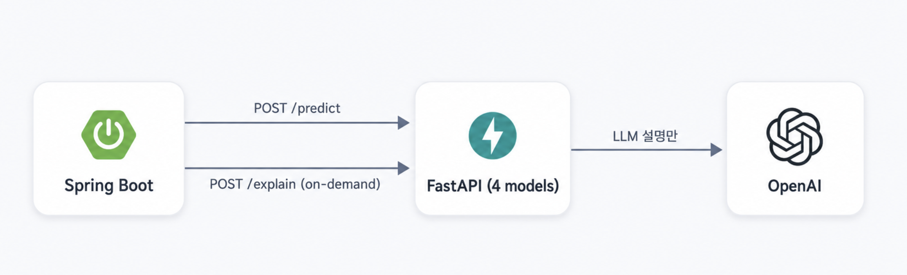

# ArcGuard AI

ArcGuard 시스템에서 분전반 센서 데이터를 분석해 전기 이상 상태를 판정하는 FastAPI 기반 AI 추론 서비스입니다.

실제 하드웨어가 없어, 이 저장소가 직접 만든 **Sensor Simulator**와 **Synthetic Dataset**으로 시나리오를 재현하고 그 위에서 학습한 4개 모델을 서빙합니다. 연구가 목적이 아니라 "AI를 백엔드 시스템에 안전하게 통합하는 구조"를 보여주는 포트폴리오입니다.

| 저장소 | 역할 |
|---|---|
| [firesafety-be](https://github.com/soyoung-v/firesafety-be) | Spring Boot — 센서 수신, 이 AI 서비스 호출 |
| [firesafety-fe-react](https://github.com/soyoung-v/firesafety-fe-react) | React 관제 대시보드 |
| **firesafety-ai** (이 저장소) | ML 추론 + LLM 설명 |

---

## Architecture



`/predict`(ML 판정)와 `/explain`(LLM 설명)은 서로 호출하지 않고 상태도 공유하지 않습니다 
— LLM 장애가 ML 판정에 영향을 주지 않습니다.

---

## Dataset & Scenario

6개 시나리오(NORMAL/OVER_CURRENT/ARC/LEAKAGE/OVERHEATING/COMPLEX_RISK) × 40 run × 400 sample = **96,000행**의 Synthetic Dataset을 생성합니다. **실제 센서 로그가 아닙니다.** 데이터 누수 방지를 위해 run 단위로 train/val/test(70/15/15)를 분리합니다.

하드웨어가 이미 계산한 판정 신호(`aerror`)는 모델 입력에서 제외했습니다 — 그대로 넣으면 모델이 원시 센서 패턴이 아니라 "정답에 가까운 신호" 하나만 보고 학습하게 되기 때문입니다.

모델 입력은 **60개 sample 단위 window**입니다("60초"가 아니라 "60개 sample" — 실제 전송 주기는 이 프로젝트 범위 밖). LEAKAGE 20mA/OVERHEATING 80℃/OVER_CURRENT 30A는 firesafety-be의 실제 기본값과 일치를 확인했고, 그 외 임계값은 이 프로젝트가 시뮬레이션용으로 정한 값입니다.

---

## Models

| 모델 | 알고리즘 | 출력 |
|---|---|---|
| ARC Classifier | LogisticRegression | `pred`/`proba` — 아크 여부(레거시 계약) |
| Risk Classifier | LogisticRegression | `riskLevel`/`riskScore` — 종합 위험 수준, **화재 확률 아님** |
| Anomaly Detector | IsolationForest | `anomaly`/`anomalyScore` — 정상 패턴 이탈 여부 |
| Next-current Regressor | HistGradientBoostingRegressor | `predictedCurrent` — 다음 sample 예상 전류(시간 단위 아님) |

`pred`/`proba`(ARC)와 `riskLevel`/`riskScore`(Risk)는 서로 다른 모델의 독립된 출력이라 섞어서 해석하지 않습니다.

Synthetic test split 기준 평가 결과(실제 성능/안전 인증을 의미하지 않음):

| 모델 | 지표 | 값 |
|---|---|---|
| ARC Classifier | accuracy/f1/roc_auc | 1.0 / 1.0 / 1.0 |
| Risk Classifier | accuracy/macro_f1 | 0.986 / 0.984 |
| Anomaly Detector | precision/recall/f1 | 0.984 / 1.0 / 0.992 |
| Current Regressor | MAE / R² | 1.24 / 0.802 |

---

## API

| Method | Path | 역할 |
|---|---|---|
| GET | `/health` | 서비스/모델 상태 |
| GET | `/model-info` | 모델 메타데이터(운영 편의용, 사용자 기능 아님) |
| POST | `/predict` | 4개 모델 추론 |
| POST | `/explain` | LLM 설명 생성 |

---

## LLM Explanation

**LLM은 판정하지 않습니다.** 이미 계산된 ML 결과와 축약된 센서 근거를 받아 한국어로 설명만 합니다("ML decides, LLM explains"). Synthetic Dataset 정답 라벨이나 원시 센서 시계열은 애초에 요청 스키마에 없어 전달할 수 없습니다.

안전 규칙: ML 값을 재계산하지 않고 그대로 인용, `riskScore`/`anomalyScore`를 화재 확률로 표현하지 않음, `predictedCurrent`를 시간 단위로 표현하지 않음, 존재하지 않는 임계값(GAS/FIRE)을 언급하지 않음. 설명은 `pred`/`riskLevel` 같은 내부 필드명 대신 "아크 판정", "종합 위험도" 같은 자연어로 표현하고, 센서 근거는 관련 있는 2~3개만 골라 언급합니다.

`/explain` 실패는 이미 저장된 ML 판정에 영향을 주지 않습니다.

---

## Sensor Simulator

실제 하드웨어 없이 `simulator/`가 firesafety-be의 하드웨어 프로토콜 엔드포인트(`/m_noUpload.php`)로 실제 인코딩 규칙 그대로 HTTP 요청을 보냅니다. 6개 시나리오를 그대로 재사용해 시간 흐름에 따른 값 변화를 재현합니다.

```
Sensor Simulator → Spring Boot → MySQL → FastAPI /predict → 진단/경보
```

---

## Engineering Highlights

**Label Leakage 방지** — 하드웨어가 이미 계산한 판정 신호를 모델 입력에서 제외해, 정답에 가까운 신호가 아니라 원시 센서 패턴만으로 학습하도록 강제했다.

**Semantic Separation** — 레거시 ARC 판정과 신규 위험도 판정을 서로 다른 모델·필드로 분리하고 API 응답에서도 절대 섞이지 않게 스키마로 강제했다.

**Explainability Boundary** — ML 판정과 LLM 설명을 완전히 분리된 엔드포인트/상태로 유지하고, 스키마 자체(`extra="forbid"`)로 정답 라벨이 LLM에 흘러들어갈 경로를 차단했다.

**Deployment Readiness** — 컨테이너가 뜬 시점과 모델 로딩이 끝난 시점이 다를 수 있어, 헬스체크에 재시도(최대 10회)를 적용하고 `127.0.0.1` 명시로 IPv6 오탐도 방지했다.

---

## Tech Stack

Python 3.11 · FastAPI · pandas/numpy/scikit-learn · OpenAI SDK(Structured Output) · pytest · Docker

---

## Test

```bash
pytest -q
```

**257 passed, 1 skipped**(환경변수 미설정으로 조건부 skip되는 optional 테스트 1건). `/explain` 관련 테스트는 전부 mock 기반이며 실제 OpenAI 호출은 없습니다.

---

## Deployment

`main` push 시 pytest(mock 기반) → Docker build → GHCR push → EC2에서 ai-service 컨테이너만 재배포됩니다. FastAPI는 8000 포트를 외부에 노출하지 않고 Spring Boot가 내부망으로만 호출하며, `OPENAI_API_KEY`는 런타임 환경변수로만 전달되고 이미지에는 포함되지 않습니다.

---

## Local Setup

```bash
python -m venv .venv && source .venv/bin/activate
pip install -r requirements.txt
cp .env.example .env
uvicorn app.main:app --reload --port 8000
```

---

## Scope & Limitations

- 모든 데이터는 Synthetic Dataset이며 실제 센서 로그가 아닙니다.
- 실제 하드웨어가 없고, 실제 화재/안전 인증 시스템이 아닙니다.
- 모델 출력은 보조 판단 정보이며 최종 의사결정을 대신하지 않습니다.
- `riskScore`/`anomalyScore`는 화재 발생 확률이 아니고, `predictedCurrent`는 시간 단위 예측이 아닙니다.
- GAS/FIRE 위험 판정 임계값은 이 프로젝트 범위 밖(TBD)입니다.
